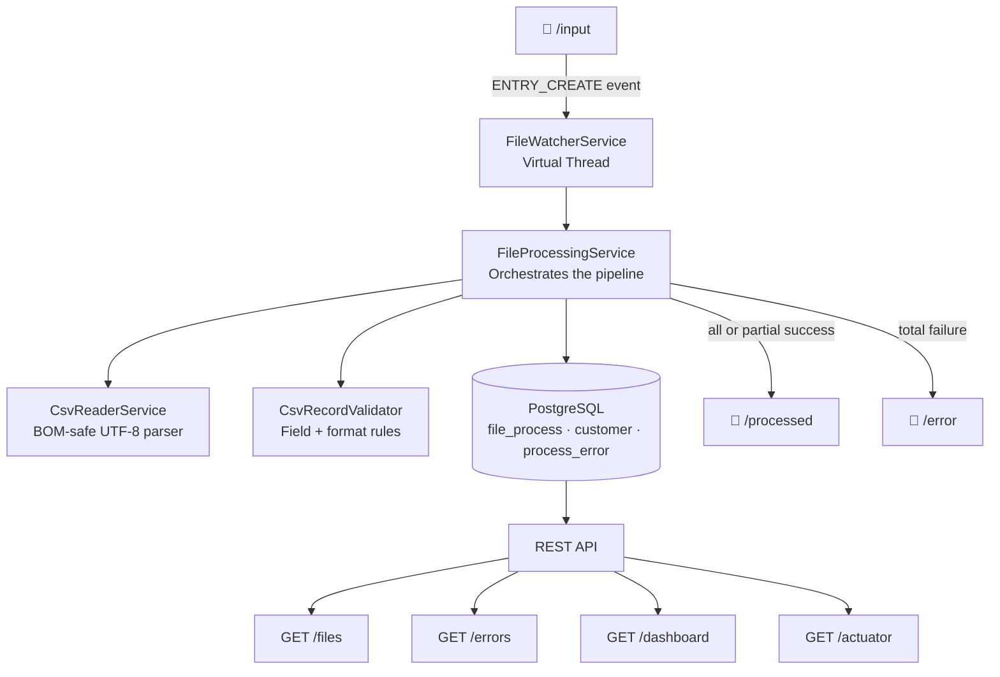
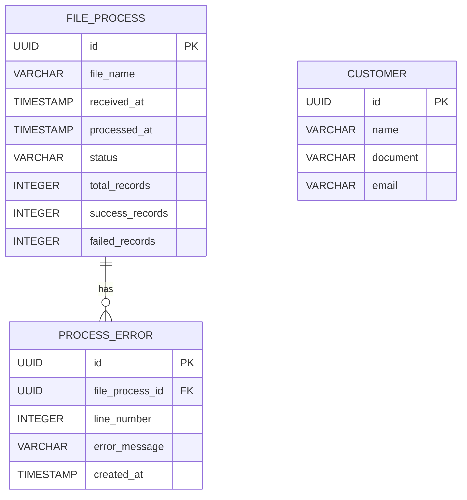

<h1 align="center">Corporate File Processor</h1>

<p align="center">
  <strong>Production-grade automated data ingestion pipeline — Java 21 · Spring Boot 4 · PostgreSQL</strong>
</p>

<p align="center">
  
  
  
  
  
  
  
</p>

---

## What This Is

A backend system that monitors a directory, automatically processes incoming CSV files, validates each record, persists results to PostgreSQL, and exposes a REST API for operational visibility — with full audit trail, per-record error tracking, and structured logging throughout.

Built to reflect the kind of file-based integration infrastructure used in logistics, ERP integrations, customs brokerage, and B2B data exchange platforms. Not a CRUD exercise.

---

## Skills Demonstrated at a Glance

| Area | What you'll find in this codebase |
|---|---|
| **Architecture** | Strict 4-layer separation: Controller → Service → Repository → Entity. Domain models act as the boundary between layers. No entity ever reaches the API. |
| **Java 21** | Java NIO `WatchService` running on a **Virtual Thread** (`Thread.ofVirtual()`) — non-blocking file monitoring without occupying platform threads |
| **Spring Boot** | `@ConfigurationProperties`, profile-based config (local / staging / prod), lifecycle events (`ApplicationReadyEvent`), Actuator |
| **Database** | Flyway versioned migrations, `ddl-auto: validate`, UUID primary keys, PostgreSQL native aggregate queries (`EXTRACT EPOCH`, `SUM`, `AVG`) |
| **Object Mapping** | MapStruct at every layer boundary — compile-time, type-safe, zero reflection at runtime |
| **CSV Parsing** | OpenCSV with annotation-driven bean mapping + UTF-8 BOM stripping (handles files exported from Windows/Excel) |
| **API Design** | RESTful conventions, `ResponseEntity` for proper HTTP status codes, Swagger/OpenAPI auto-generated documentation |
| **Error Resilience** | Partial processing — a single invalid record does not abort the file. Every error is persisted with exact CSV line number and reason. |
| **Observability** | Structured SLF4J logging per file and per record, Spring Actuator (`/health`, `/metrics`), dashboard endpoint with DB-computed KPIs |
| **Code Quality** | Constructor injection throughout, no `@Autowired` on fields, Lombok without `@Data` on JPA entities |

---

## System Architecture



---

## Processing Pipeline

```
File arrives → RECEIVED → parse CSV → PROCESSING → validate each record
                                                          ↓              ↓
                                                    persist Customer   persist ProcessError
                                                          ↓              ↓
                                          COMPLETED / COMPLETED_WITH_ERRORS / FAILED
                                                          ↓
                                                   move to /processed or /error
```

Every transition is persisted. Every error is stored with its CSV line number. Nothing is silently discarded.

---

## Project Structure

```
src/main/java/.../
├── config/          → @ConfigurationProperties for directory paths
├── controller/      → REST endpoints + response DTOs + MapStruct mappers
├── dto/             → CsvRecord (OpenCSV @CsvBindByName mapping)
├── entity/          → JPA entities (never leave this layer)
├── enums/           → FileProcessStatusEnum (5 states)
├── model/           → Domain models (the shared language between layers)
├── repository/      → Domain repos + Spring Data JPA interfaces + MapStruct mappers
├── service/         → Business logic, orchestration, validation, queries
└── watcher/         → NIO WatchService + Virtual Thread bootstrap
```

---

## API Endpoints

| Method | Endpoint | Description |
|--------|----------|-------------|
| `GET` | `/files` | All file processing records |
| `GET` | `/files/{id}` | Single record by UUID — returns `404` if not found |
| `GET` | `/errors` | All per-record validation errors with line numbers |
| `GET` | `/dashboard` | Computed metrics: total files, total errors, avg processing time (seconds), total records processed |
| `GET` | `/actuator/health` | Health status |
| `GET` | `/actuator/metrics` | JVM and application metrics |

Swagger UI: `http://localhost:8080/swagger-ui.html`

---

## Database Schema



Schema is version-controlled via Flyway (`V1`, `V2`, `V3`). The application never modifies schema directly — `ddl-auto: validate` enforces this at startup.

---

## Engineering Decisions Worth Noting

**Virtual Threads over a scheduled polling loop** — `WatchService` blocks the thread while waiting for filesystem events. Using a Virtual Thread means this has near-zero overhead, unlike a `@Scheduled` polling approach that wakes up on a timer whether or not there is work to do.

**Separate domain repositories from Spring Data interfaces** — `CustomerRepository` wraps `CustomerJpaRepository`. The service layer never touches Spring Data directly. Swapping the persistence layer requires changes in one place only.

**MapStruct at every boundary** — entity ↔ model (repository layer), model ↔ response (controller layer). Enforced at compile time. No `BeanUtils.copyProperties`, no manual field assignment, no risk of silent null propagation across layers.

**DB-side aggregation for dashboard** — `SUM`, `COUNT`, `AVG` run as native PostgreSQL queries. Fetching all rows into memory to compute these in Java would not scale and is an anti-pattern this project explicitly avoids.

**Partial file processing** — rejecting an entire file because one record has an invalid email is not acceptable in production. Each record is processed independently. The final status (`COMPLETED_WITH_ERRORS`) reflects exactly what happened.

---

## Running Locally

**Prerequisites:** Java 21+, Docker Desktop

```bash
# 1. Clone
git clone https://github.com/GabrielSanchesRosa/corporate-file-processor
cd corporate-file-processor

# 2. Start PostgreSQL (Flyway runs automatically on app startup)
docker compose up -d

# 3. Create local config
# src/main/resources/application-local.yaml
spring:
  datasource:
    url: jdbc:postgresql://localhost:5432/corporate_file_processor
    username: root
    password: root

# 4. Run
./mvnw spring-boot:run -Dspring-boot.run.profiles=local
```

Drop any CSV into the configured `/input` directory. The system picks it up immediately.

### Expected CSV Format

```
name;document;email
John Smith;12345678901;john@example.com
Jane Doe;98765432100;
Invalid;;not-an-email
```

---

## What Would Come Next in a Production System

- **RabbitMQ / Kafka** — decouple file detection from processing; enable horizontal scaling across multiple consumer instances
- **JWT Authentication** — secure the API for multi-tenant deployments  
- **Testcontainers** — integration tests with a real PostgreSQL instance spun up per test run
- **Prometheus + Grafana** — time-series metrics and alerting on processing failures
- **Cloud Storage** — replace filesystem watching with S3/GCS bucket event notifications
- **Kubernetes** — containerized deployment with auto-scaling based on queue depth
